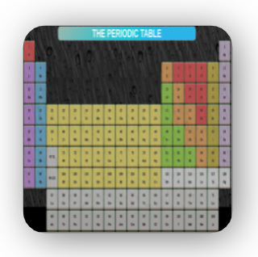
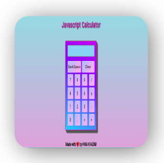
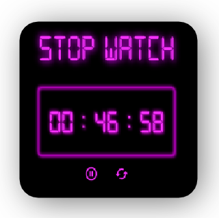

# Web_and_Hybrid_mobile_dev

Demo : https://web-and-mobileapps.web.app

This course includes my learning of

- Html5,
- Css3,
- Bootstrap,
- Git & Github,
- JavaScript
- JavaScript DOM

I have made the following projects up till now.

|    **Periodic Table**    |  **Registration Form** |
| :---------------------------------------------------------------------------------------------------------------------------------------------: | :------------------------------------------------------------------------------------------------------------------------------------------------------: |
|  **Saylani Landing Page** |                     **Grocty - Ecommerce App**                     |
|                 **Calculator**                |                       **StopWatch**                       |

1. Periodic Table
2. Registeration Form
3. Saylani Landing Page (Mobile Responsive)
4. Grocty - Ecommerce Webstie (Mobile Responsive)
5. JavaScript Calculator
6. StopWatch
